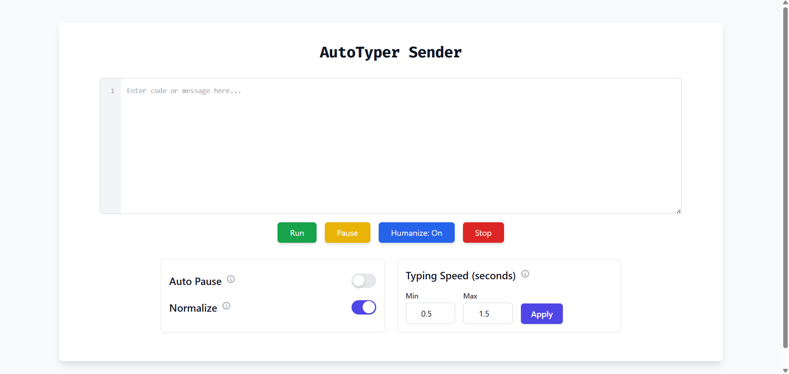

# AutoTyper Sender & Receiver

## About

AutoTyper is an automated typing tool designed to simulate natural typing behavior, useful for testing, automation, or productivity applications. It consists of two main components: the **Sender** (client-side) and the **Receiver** (server-side). The Sender sends messages to the Receiver to simulate typing actions, while the Receiver manages these commands and processes them.

The **Sender** provides a web interface where users can input messages or code, configure typing speed, and control the typing process (start, stop, pause, resume, etc.). The **Receiver** listens for incoming commands from the Sender, processes them, and simulates typing in a terminal or browser environment.

This project is built using **WebSockets** for real-time communication between the Sender and Receiver.

### Web Interface - Sender Control Panel



## Structure

```
AutoTyper/
│
├── receiver.py # Python script for the Receiver (server-side)
├── sender.py # Python script for the Sender (client-side)
├── requirements.txt # Python dependencies for both Receiver and Sender
├── static/
│ └── control-panel.png # Screenshot of the Sender web interface
├── templates/
│ └── index.html # HTML template for the Sender web interface
├── README.md # This README file
└── LICENSE # License file for the project
```

## Technologies Used

- **Frontend**: 
  - HTML, CSS (TailwindCSS), JavaScript
  - WebSockets for real-time communication
  - Font: Fira Code (monospace)
  
- **Backend**:
  - **Receiver**: Python (Flask, WebSockets)
  - **Sender**: Python (Socket communication)

- **Web Interface**:
  - Built with HTML, styled using **TailwindCSS**
  - Real-time interaction using **WebSocket**

## Setup Instructions

### Receiver Setup

The Receiver script is a Python-based backend that listens for incoming requests and communicates with the Sender using WebSockets.

1. Clone this repository to your local machine or server:
    ```bash
    git clone https://github.com/kalpthakkar/AutoTyper.git
    cd AutoTyper
    ```

2. Install the required Python dependencies:
    ```bash
    pip install -r requirements.txt
    ```

3. Get your **IPv4 Address**:
    - Open Command Prompt or Terminal on your system.
    - Run `ipconfig` (Windows) or `ifconfig` (Linux/macOS) and note down your **IPv4 Address**.
    - Note this IP address for the Sender.

4. Run the Receiver server:
    ```bash
    python receiver.py
    ```

5. The server should now be running on `http://localhost:8000`.

### Sender Setup

The Sender is a Python script that connects to the Receiver's WebSocket server. It provides a web interface for sending and controlling typing tasks.

1. Clone this repository to your local machine or another system:
    ```bash
    git clone https://github.com/kalpthakkar/AutoTyper.git
    cd AutoTyper
    ```

2. Install the required Python dependencies:
    ```bash
    pip install -r requirements.txt
    ```

3. Run the Sender with the Receiver's IP address:
    ```bash
    python sender_web/app.py <receiver_url>

    ```

    Replace `<receiver_url>` with the following format, where `<receiver-ip>` is the IP address of the Receiver:
    ```bash
    http://<receiver-ip>:8000
    ```

4. The Sender will start a web interface at `http://localhost:5000`. Open this URL in a browser to interact with the Sender interface.

## Usage

### Sender:

- **Start Typing**: Type your message or code in the input area and click **Run** to begin the typing simulation.
- **Pause/Resume**: Pause the typing at any point and resume from where it left off.
- **Stop**: Immediately stop the typing process.
- **Humanize Typing**: Enable or disable to mimic **true human-like typing effect** through random delays, speed fluctuations, and occasional small typos that get autocorrected.
- **Auto Pause**: Enable auto-pausing after each line.
- **Normalize Whitespace**: Ensure that leading spaces/tabs are ignored before typing.

### Receiver:

- The Receiver listens for commands sent from the Sender and processes them according to the received instructions.
- It can simulate typing actions based on the data sent by the Sender.

## Features

- **Real-time Web Interface**: Interact with the Sender via a web interface.
- **Typing Simulation**: Simulate typing with configurable speed, pauses, and true human-like typing behaviour.
- **Auto Pause**: Automatically pauses typing after each line for more controlled typing.
- **Normalize Whitespace**: Normalize leading spaces/tabs for more predictable typing.
- **WebSocket Communication**: Real-time two-way communication between Sender and Receiver via WebSockets.
- **Cross-Platform**: Both Sender and Receiver can run on various platforms (Windows, Linux, macOS).

## Applications

- **Automation**: Automate repetitive typing tasks in UI-based applications.
- **Testing**: Use for automated UI testing or to simulate human-like interaction in web forms.
- **Productivity**: Speed up coding or documentation tasks by automating repetitive typing.
- **Training**: Simulate typing behavior for training purposes (e.g., to practice touch typing).

## License

This project is licensed under a **Custom License**. You are allowed to:

- Use this software for **personal** or **educational** purposes only.
- Modify and adapt the code for **personal use**.

**Attribution**: If you use or redistribute this software, you must provide proper attribution to the original author (this project).  

**Commercial Use**: You may not use this software for commercial purposes without explicit permission. For commercial use or redistribution, please contact the author for permission.

For more details, please refer to the [LICENSE](./LICENSE) file in this repository.